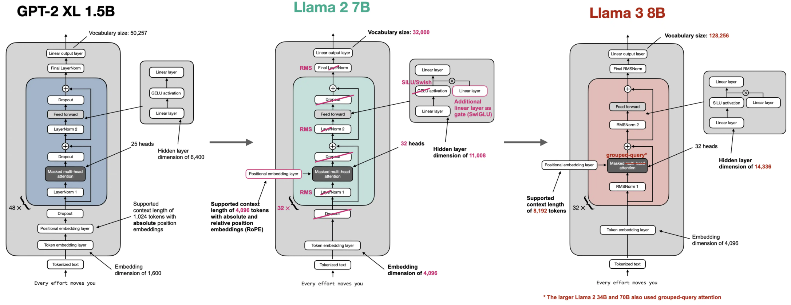
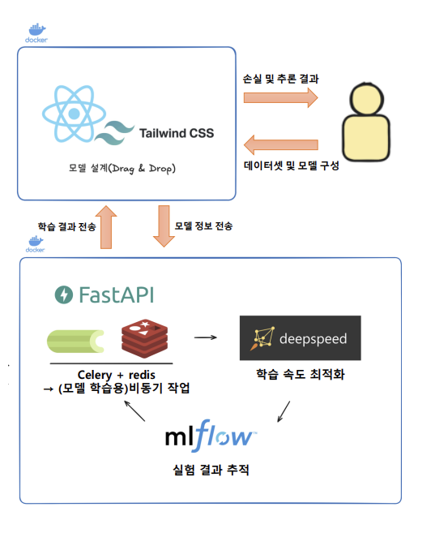

# 졸업과제 – SLaM Dunk: 경량 언어 모델 학습 플랫폼

## 1. 프로젝트 배경

### 1.1 국내외 시장 현황 및 문제점

- 대규모 언어 모델(LLM)은 다양한 자연어 처리 작업에서 뛰어난 성능을 발휘하고 있음.
- 하지만 학습과 운영에 막대한 **GPU 자원, 메모리, 비용**이 요구되어 교육/연구 현장에서 활용하기 어려움.
- 특히 개인 연구자나 학생들이 **직접 모델 구조를 이해하고 실험**하기에는 접근 장벽이 큼.
- 따라서, 가벼운 환경에서도 학습 가능한 **경량 언어 모델(Small Language Model, SLM)** 기반 학습 플랫폼의 필요성이 대두됨.

### 1.2 필요성과 기대효과

- **웹 기반 시각화 도구**를 통해 사용자가 직접 모델 구조를 설계하고 직관적으로 이해할 수 있음.
- **구성 → 학습 → 추론** 전 과정을 경험함으로써 언어 모델의 원리를 쉽게 체득 가능.
- **소규모 데이터셋 + 경량 모델**을 통해 GPU 자원이 제한된 환경에서도 학습 실습이 가능.
- 교육 및 연구 목적에 최적화된 **공개형 실습 플랫폼**으로 활용될 수 있음.

---

## 2. 개발 목표

### 2.1 목표 및 세부 내용

- **프론트엔드(Canvas)**: ReactFlow 기반 Drag & Drop 방식으로 모델 블록 구성
- **백엔드(FastAPI + Celery)**: JSON 기반 모델 구조 검증 및 학습 태스크 실행
- **실시간 모니터링**: Redis Pub/Sub + SSE 기반 학습 로그 및 상태 스트리밍
- **실험 관리**: MLflow를 활용하여 하이퍼파라미터와 결과 기록 관리
- **추론 기능**: 학습 완료 모델을 활용한 텍스트 생성 API 제공

### 2.2 기존 서비스 대비 차별성

- 단순 추론 서비스가 아닌, 사용자가 **직접 모델을 설계하고 학습**할 수 있는 환경 제공
- **블록 단위 시각화**를 통한 교육 친화적 UI/UX 제공
- **모델 설계 → 학습 → 추론**이 하나의 파이프라인에서 통합적으로 동작

### 2.3 사회적 가치 도입 계획

- **공공성**: 누구나 웹 환경에서 무료로 접근 가능
- **지속 가능성**: 모듈화된 구조로 다양한 모델과 기능 확장이 용이

---

## 3. 시스템 설계

### 3.1 시스템 구성도

본 프로젝트는 **프론트엔드 – 백엔드 – 학습 워커 – 실험 관리**의 구조로 설계되었습니다.  
사용자는 웹 UI에서 모델 구조를 설계하고, 백엔드를 통해 학습을 요청하며, 학습 상태는 실시간으로 모니터링할 수 있습니다.

### 3.2 사용 기술

- **Frontend**

  - React, ReactFlow: 모델 구조 시각화 및 드래그 앤 드롭 구성
  - TypeScript, TailwindCSS: 안정적인 UI 개발 및 스타일링
  - Vite: 프론트엔드 개발 환경 및 번들링

- **Backend**

  - FastAPI: REST API 서버
  - Celery: 비동기 학습 태스크 처리
  - Redis: Pub/Sub 기반 학습 상태 스트리밍 및 태스크 제어
  - MLflow: 실험 관리 및 결과 추적

- **Machine Learning**

  - PyTorch: 모델 구현 및 학습
  - HuggingFace Datasets: 학습 데이터셋 로드
  - Custom Modules: TokenEmbedding, PositionalEmbedding, Attention 등 모듈 단위 구현

- **Infrastructure**
  - Docker, Docker Compose: 서비스 컨테이너 관리
  - GitHub: 형상 관리 및 협업

### 3.3 참고한 모델 구조



---

## 4. 개발 결과

### 4.1 전체 시스템 흐름도

본 시스템은 **프론트엔드 – 백엔드 – 학습 워커 – 결과 저장소**의 파이프라인으로 동작합니다.  
사용자는 웹에서 모델을 설계하고 학습을 시작하면, 백엔드가 Celery 워커를 통해 학습을 수행하고 그 과정을 SSE로 실시간 전송합니다. 학습이 완료된 모델은 저장소에 보관되며 추론 API를 통해 활용할 수 있습니다.



_(예: 학습 요청 → 모델 구조 검증 → 학습 실행 → 상태 모니터링 → 결과 저장/추론)_

---

### 4.2 기능 설명 및 주요 기능 명세서

| 기능                                         | 설명                                                                       | 입력                                | 출력                                    |
| -------------------------------------------- | -------------------------------------------------------------------------- | ----------------------------------- | --------------------------------------- |
| **모델 구조 검증**                           | 프론트에서 설계한 JSON 기반 모델 구조를 PyTorch 모듈로 변환 가능 여부 확인 | Layer JSON                          | 구조 검증 결과 (성공/실패, 파라미터 수) |
| **학습 시작 (/train-complete-model)**        | 모델 구조 검증 후 MLflow에 Run 생성, Celery 태스크로 학습 시작             | 모델 JSON, Config, Dataset          | 학습 태스크 ID, SSE URL, MLflow 링크    |
| **실시간 상태 스트리밍 (/events/{task_id})** | Redis Pub/Sub 기반으로 학습 상태(에포크, 손실 값, 완료 여부) 스트리밍      | Task ID                             | SSE 이벤트 스트림                       |
| **학습 중단 (/stop-training)**               | Redis Stop Flag 또는 강제 kill로 학습 종료                                 | Task ID                             | 중단 요청 결과                          |
| **완료 모델 관리 (/completed-models)**       | 학습 완료된 모델 목록 조회                                                 | -                                   | 완료 모델 리스트 (구조 파일 여부 포함)  |
| **추론 (/generate-text)**                    | 학습된 모델을 불러와 입력 텍스트에 대한 생성 결과 반환                     | 모델명, 입력 텍스트, 하이퍼파라미터 | 생성된 텍스트                           |


---

### 4.3 디렉토리 구조

```

backend/
├── completed/ # 학습 완료된 모델(.pt) 저장
├── ml/ # 모델 관련 모듈 (factory 등)
├── mlartifacts/ # MLflow 아티팩트 저장소
├── mlruns/ # MLflow 실험 기록
├── model_structures/ # 저장된 모델 구조 정의
├── routes/ # FastAPI 라우터
│ ├── train_routes.py # 학습 시작, 모델 검증
│ ├── inference_routes.py # 텍스트 생성 추론
│ ├── completed_routes.py # 완료 모델 조회
│ ├── stop_routes.py # 학습 중단
│ └── events.py # SSE 이벤트 스트리밍
├── tasks/ # Celery 학습 태스크
│ ├── train.py # 학습 및 손실 계산 루프
│ ├── dataset.py # 데이터셋 로더
│ ├── tokenizers.py # 토크나이저 어댑터
│ └── structure.py # 모델 구조 검증
├── temp_structures/ # 임시 모델 구조 JSON
├── venv/ # 가상환경 (개발용)
├── celery_app.py # Celery 설정
├── celery_worker.py # Celery 워커 실행 스크립트
├── deps.py # Redis 연결 등 공통 의존성
├── main.py # FastAPI 실행 진입점
├── Dockerfile # 백엔드 도커 설정
├── requirements.txt # Python 의존성 패키지
└── README.md

```

```
frontend/
├── public/
│ └── img/ # 정적 이미지 리소스
│ └── basketball.svg
├── src/
│ ├── assets/ # 정적 자원
│ ├── constants/ # 모델 설정 및 필드 정의
│ ├── nodes/ # ReactFlow 노드 컴포넌트
│ ├── store/ # 전역 상태 관리
│ ├── ui-component/ # 공통 UI 컴포넌트
│ ├── App.tsx # 메인 앱 엔트리
│ ├── ButtonEdge.tsx # 커스텀 엣지 컴포넌트
│ ├── Config.tsx # 모델 설정 패널
│ ├── DatasetSelection.tsx # 데이터셋 선택 UI
│ ├── FlowCanvas.tsx # 모델 설계 캔버스
│ ├── Sidebar.tsx # 사이드바 UI
│ ├── SidebarNodeItem.tsx # 사이드바 노드 항목
│ └── TestPage.tsx # 테스트용 페이지
├── index.css # 전역 스타일
├── main.tsx # React 엔트리포인트
└── package.json # 프론트엔드 의존성
```

---

## 5. 설치 및 실행

```bash
docker compose up -d
```

## 5.2 오류 해결

- **Redis 연결 오류** → `docker ps`로 Redis 실행 여부 확인
- **MLflow 연결 오류** → `MLFLOW_TRACKING_URI` 환경변수 확인

## 6. 소개 자료 및 시연 영상

- 프로젝트 발표 PPT: `/docs/03.발표자료/presentation.pdf`
- 시연 영상
  [프로젝트 발표 동영상](https://www.youtube.com/watch?v=ZKH90zYx9Ow)
  

## 7. 팀 구성

- **김명석 (팀장)** – 프로젝트 총괄, 프론트엔드(React, ReactFlow) UI 개발 및 모델 노드 시각화
- **염현석** – 백엔드(FastAPI, Celery, Redis) 설계 및 학습 파이프라인 구현
- **정지윤** – 데이터셋 로딩 및 전처리, MLflow 기반 실험 관리 및 결과 분석

## 8. 참고 문헌 및 출처

1. S. Raschka, _Build a Large Language Model From Scratch_. OceanofPDF, 2024.
2. T. Brown et al., “Language Models are Few-Shot Learners,” in _Advances in Neural Information Processing Systems (NeurIPS)_, 2020.
3. Meta AI, “LLaMA: Open and Efficient Foundation Language Models,” _arXiv:2302.13971_, 2023.
4. MLflow. (2024). _MLflow: Open source platform for the machine learning lifecycle_. [Online]. Available: [https://mlflow.org](https://mlflow.org)
5. S. Raschka, _Build a Large Language Model From Scratch — Official Code Repository_, GitHub, 2024. [Online]. Available: [https://github.com/rasbt/LLMs-from-scratch](https://github.com/rasbt/LLMs-from-scratch)
6. HuggingFace Datasets. [Online]. Available: [https://huggingface.co/datasets](https://huggingface.co/datasets)
7. Redis Pub/Sub Documentation. [Online]. Available: [https://redis.io/docs/interact/pubsub](https://redis.io/docs/interact/pubsub)
